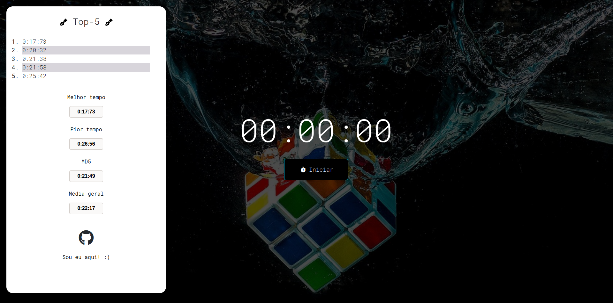
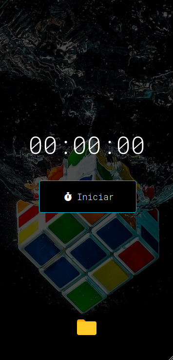
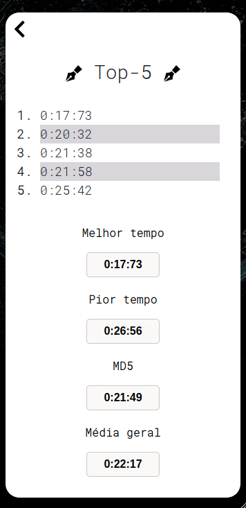

<h1 align = "center">⏰ TimerTest ⏰</h1>

 

## 📘 Sobre

O TimerTest é um simples cronômetro feito para speedcubing  e ligeiramente inspirado no CSTimer, onde você marca seus tempos, que ficam registrados em uma tabela através do Session Storage do navegador.

<h1 align = "center">📎 Acesse o site <a href = "https://timertestjs.herokuapp.com/">aqui</a></h1>

## 📝 Tabela de conteúdo

<!--ts-->
   * [Sobre](https://github.com/gust-f/TimerTest/blob/main/README.md#-sobre)
   * [Tabela de Conteúdo](https://github.com/gust-f/TimerTest/blob/main/README.md#-tabela-de-conte%C3%BAdo)
   * [Como usar](https://github.com/gust-f/TimerTest/blob/main/README.md#-como-usar)
      * [Versão mobile](https://github.com/gust-f/TimerTest/blob/main/README.md#-vers%C3%A3o-mobile)
   * [Tecnologias](https://github.com/gust-f/TimerTest/blob/main/README.md#%EF%B8%8F-tecnologias)
   * [Autor](https://github.com/gust-f/TimerTest/blob/main/README.md#%EF%B8%8F-autor)
<!--te-->

<h2 align="center"> 🚧  Finalizado  🚧</h4>

## 👨‍💻 Como usar

A interface do site é simples e intuitiva, contendo apenas um timer com o botão de iniciar e uma tabela no canto esquerdo, onde os tempos são registrados por sessão.

## 📱 Versão mobile

O site é responsivo para aparellhos mobile, sendo também possível registrar seus tempos no celular, onde a tabela de tempo é acessada através do ícone de pasta na parte inferior do site.

## 🛠️ Tecnologias

As seguintes ferramentas foram usadas na construção do projeto:

- 

-  

-   

-  

-  

 

## 🖊️ Autor

 
 
 <b><h5>Gustavo Fernandes</h5></b> 

Feito com ❤️ por Gustavo Fernandes

